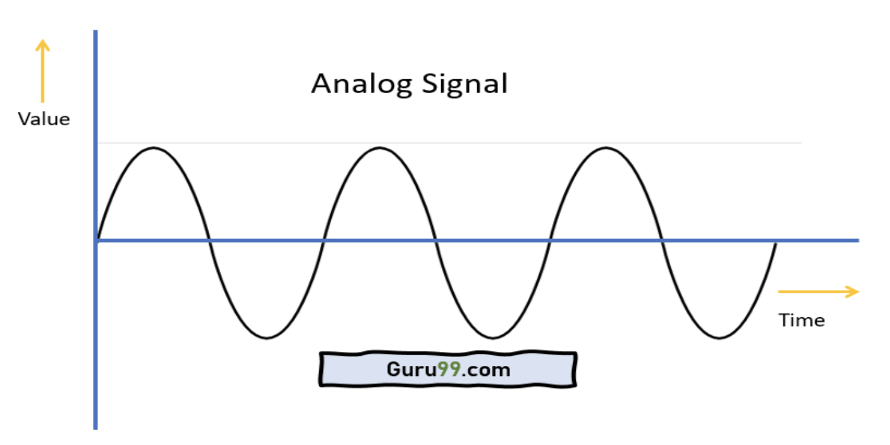

# Minecraft 기반 컴퓨터 논리 아키텍처 구현

## 요약

컴퓨터에서 데이터 연산과 저장은 아주 자주 일어나는 작업입니다. 이 탐구 보고서에서는 아날로그 데이터와 디지털 데이터에 대해 알아보고, 두 데이터를 비교해 보았습니다. 컴퓨터가 디지털 데이터를 사용하는 이유를 2진수 시스템으로 설명했습니다. 그리고 2진수를 활용한 컴퓨터의 연산 방법인 부울 대수와 논리 게이트를 설명했습니다. 논리 게이트의 기본인 AND, OR, NOT이 어떻게 일하는지 설명하고, 그것을 응용한 XOR, NAND, NOR을 설명했습니다. 이런 논리게이트로 논리회로를 만들고, 컴퓨터가 정보를 저장하고 처리(연산) 하는 방법을 반가산기, 전가산기, SR 플립플롭을 사용해서 설명했습니다. 마지막으로 Minecraft World Map에 Redstone 및 Redstone Torch, Redstone Lamp 등 각종 Redstone 관련 인벤토리 아이템을 써서 위에 설명한 논리 회로를 만들었습니다. 그것으로 논리회로가 일하는 방법을 설명했습니다. 그래서 이 탐구보고서를 보면 누구나 논리게이트와 논리회로가 일하는 방법을 쉽게 알 수 있도록 썼습니다.

## 1. 아날로그 데이터 및 디지털 데이터

데이터를 표현하는 방법은 크게 아날로그 데이터와 디지털 데이터로 나뉩니다. 이 섹션에서는 아날로그 데이터와 디지털 데이터가 무엇인지 알아보고 두 데이터 표현 방법을 비교합니다.

### 1.1. 아날로그 데이터

아날로그 데이터는 continuous 합니다. 
사람이 말하는 소리는 공기에 wave가 생깁니다. 이런 게 아날로그 데이터입니다. 
지진, 쓰나미, 태풍, 주파수, 화산, 바람도 아날로그 데이터입니다.
아날로그 데이터 그래프는 아래와 같이 그릴 수 있습니다.

### 1.2. 디지털 데이터

디지털은 0과 1로 구분되는 discrete, separate 인 데이터입니다.  
컴퓨터는 0과 1로 데이터를 저장하고 처리합니다. 이것은 디지털 데이터입니다.  
컴퓨터에서 0은 전기가 흐르지 않는 상태, 1은 전기가 흐르는 상태(5V 등) 입니다. 디지털 데이터의 그래프는 아래와 같습니다.

### 1.3. 컴퓨터가 디지털 데이터를 사용하는 이유

앞에서 아날로그 데이터와 디지털 데이터에 대해 봤습니다. 
컴퓨터가 디지털 데이터를 사용하는 이유는 컴퓨터가 2진수(0과 1)를 쓰게 만들어졌기 때문입니다. 
컴퓨터에 있는 트랜지스터는 두 가지 방식(0과 1)으로 표현이 가능합니다. 그리고 논리 게이트도 0과 1을 사용합니다. 그래서 컴퓨터는 0과 1만을 사용하는 2진수 시스템입니다. 
컴퓨터의 논리 게이트는 전원이 켜진 상태를 1로, 전원이 꺼진 상태를 0으로 결정하도록 만들어졌습니다. 컴퓨터는 5V의 전기가 흐르면 1을 표현하고, 0V의 전기가 흐르면 0을 표현합니다. 
컴퓨터가 이진법이 아니라 3진법, 8진법, 10진법을 기본 규칙으로 사용한다면 이를 구별하는 시스템이 쉽지 않을 것입니다. 예를 들어, 5V의 전기가 최대이고 10 진수를 쓴다면 컴퓨터는 더 많은 규칙을 정해야 할 것입니다.
물론 그런 시스템을 쓸 수는 있을것입니다. 하지만 좋은 방법이 아니라고 생각합니다. 전기를 체크하고 나타내는 시간도 더 많이 걸릴 것입니다. 그래서 컴퓨터는 2진수를 사용하고, 디지털 데이터를 사용합니다.

## 2. 컴퓨터의 연산

컴퓨터는 0과 1로만 작업을 하니까 이것을 처리하려면 규칙이 필요합니다. 부울 대수는 0과 1의 논리 연산을 다루는 규칙입니다. 그리고 그것은 컴퓨터의 논리 회로를 구성하는 논리 게이트에 사용됩니다. 논리 게이트는 부울 대수의 작업을 수행합니다. 논리 게이트에는 AND, OR, NOT이 있습니다. 또 이런 게이트를 사용하여 XOR, NOR, NAND 게이트를 만들 수 있습니다. 이를 바탕으로 컴퓨터의 데이터 처리 과정을 보겠습니다.

## 2.1. 부울 대수

부울 대수에는 OR(논리합), AND(논리곱), NOT(논리부정) 연산이 있습니다. 
NOT 연산은 반대값을 갖게 되는 논리게이트로 0의 NOT은 1이 되고, 1의 NOT은 0이 됩니다. AND 연산은 multiple operation입니다. A와 B Input 중 하나라도 0이라면 답은 0이 됩니다. OR 연산은 addition operation입니다. A와 B Input 중 하나라도 1이라면 답은 1입니다. 이렇게 기본연산들을 사용하여 부울 대수의 기본정리와 여러 법칙들을 나타낼 수 있습니다.

### 2.2. 논리 게이트 (AND, OR, NOT, XOR, NOR, NAND)

디지털 컴퓨터의 기본 구성 요소를 논리회로라고 합니다. 이 논리회로는 2진수로 논리연산을 하고 답을 냅니다. 여기에서 가장 기본이 되는 회로를 논리 게이트라고 부릅니다. 논리 게이트는 부울 대수를 전자회로에 나타낸 것입니다. 
여기에는 부울대수의 기본연산인 AND, OR, NOT과 이를 확장한 XOR, NOR, NAND 게이트가 있습니다. 논리게이트들은 아래와 같이 표현되며, 아래와 같은 성질을 가지고 있습니다.
XOR 게이트는 exclusive한 성질이 있습니다. 그래서 XOR 게이트의 원래 이름은 eXclusive OR입니다. eXclusive OR은 그냥 OR과 똑같지만 입력 값 두개가 같으면 거짓을 출력합니다. 두 변수(A, B)의 입력 값이 다르면 참이 되고 두 변수의 입력 값이 같으면 거짓이 됩니다. NAND 게이트와 NOR 게이트는 AND 와 OR 게이트에 NOT이 붙은 게이트입니다. NAND 게이트는 다른 논리 게이트를 구현할 수 있다는 장점이 있습니다. 그래서 플래시 메모리에 사용될 수 있습니다. 처음에는 NOR 게이트가 플래시 메모리에 사용되었지만 NAND 게이트의 가격이 더 싸서 NAND 게이트로 바뀌게 되었습니다. NXOR은 XOR에 NOT이 붙은 것입니다. 

## 3. 논리회로 이론 및 **Minecraft** 구현

지금까지논리게이트에 대한 내용을 말했습니다. 이제부터는 컴퓨터가 정보를 저장하고 처리하는 방법을 논리회로로 만들 것입니다. 이 파트에서는 두 개의 비트를 더하는 연산을 하는 가산기와 1비트의 정보를 저장하는 회로인 SR 플립플롭을 살펴볼 것입니다. 마지막으로, Minecraft 게임에서 Redstone으로 Map을 만들고 논리회로를 만들것입니다. 그래서 실제로 어떻게 되는지 보여줄 것입니다.

### 3.1. 반가산기

두 개의 입력 변수 A, B가 있고 두 변수를 더해준 결과가 나오는 Sum 과 Carry 변수가 있습니다. 두 입력 변수 A와 B 중 하나만 1이면 두개를 더한 결과가 답에서 나옵니다. 두 개의 입력 변수 A와 B가 모두 1이면 올림자리에 1을 더해서 Carry에 1이 나와야 합니다. 왜냐면 숫자 "2" 는 2진수에서 나올 수 없기 때문입니다. Sum은 변수 A와 B가 같지 않을 때 1이 나오니까 XOR입니다. Carry는 변수 A와 B가 모두 참일 때 1이 나오니까 AND입니다. 반가산기는 아래와 같이 표현될 수 있으며 Minecraft에서는 아래와 같이 만들 수 있습니다.

### 3.2. 전가산기

반가산기는 2개의 변수 A, B를 더하여 Sum과 Carry를 구하기 위한 회로입니다. 전가산기는 반가산기의 발전형입니다. 3개의 변수, A, B, C가 입력되었을 때 3개의 변수를 더하여 Sum과 Carry를 얻어내는 것입니다. 이번에는 전가산기를 만들어 보도록 하겠습니다. 전가산기는 아래와 같이 표현될 수 있으며 Minecraft에서는 아래와 같이 만들 수 있습니다.

### 3.3. 플립플롭

플립플롭은 컴퓨터에 1비트의 정보를 저장하는 회로입니다. 그중에서도 가장 유명한 Set-Reset플립플롭에 대해 알아 보겠습니다. SR 플립플롭은 NAND 게이트로 구성되어 있으며, 두 개의 입력값 S와 R이 있습니다. 두개의 결과가 나오며 Q와 Q’라고 합니다. 이 둘은 서로 다른 값을 내보냅니다. 플립플롭의 결과는 Q인데, 이 값은 다른 값으로 바뀌어지기 전까지는 변하지 않고 그대로 남아 있습니다. 그래서 그 값이 플립플롭의 저장값이 됩니다. S와 R에 모두 0을 입력하는 경우 Q와 Q’ 값이 서로 다르다는 성질을 만족하지 못합니다. 그래서 이런 일은 생겨서는 안됩니다. 이런 경우는 RAM과 같습니다. 컴퓨터가 꺼질 때 RAM의 데이터가 사라지는게 바로 이런 상황입니다. 컴퓨터가 똑바로 작동할 때는 이런 일이 생기지 않습니다.

1) S에 0, R에 1을 입력하게 되면 위에 있는 NAND 게이트는 다른 입력값과 상관없이 1이 나옵니다. 그래서, Q는 1이 되고, Q'은 반대가 되므로 Q'은 0이 됩니다. 그림에서 SR 플립플롭은 1을 출력하고 저장값도 1이 됩니다.

2) Q가 1인 상태에서 S에 1, R에 1을 입력하게 되면, 위에 있는 NAND 게이트는 1을, 아래에 있는 NAND 게이트는 0을 출력합니다. 그래서 Q는 1이 되고 Q'은 반대로 0이 됩니다. 그래서 원래의 값 1을 저장하고 있는 것을 알 수 있습니다. 

이 것을 Minecraft에서는 아래처럼 만들 수 있습니다.

## 4. 결론

이 탐구보고서를 작성하며 컴퓨터에서 정보를 처리하고 저장하는 방법에 대해 이해할 수 있었습니다. 특히 컴퓨터의 5대 기능인 입력, 기억, 연산, 제어, 출력 기능에 대해 이해할 수 있었습니다. 아날로그 데이터와 디지털 데이터가 무엇이며 어떻게 다른지, 그리고 2진수에 대해 알게 되었습니다. 

또 컴퓨터에서 정보를 연산하고 저장하는 방법을 부울 대수, 논리 게이트, 논리 회로를 통해 분석해 볼 수 있었습니다.

## 참고자료

* https://www.guru99.com/analog-vs-digital.html

- https://terms.naver.com/entry.nhn?docId=2270363&cid=51173&categoryId=51173
- https://ko.wikipedia.org/wiki/%EA%B0%80%EC%82%B0%EA%B8%B0
- https://instrumentationtools.com/logic-gates/ 
- https://blog.naver.com/asd7979/30108134761
- http://blog.naver.com/PostView.nhn?blogId=asd7979&logNo=30108683862
- https://minecraft-ko.gamepedia.com/%EB%A9%94%EB%AA%A8%EB%A6%AC_%ED%9A%8C%EB%A1%9C